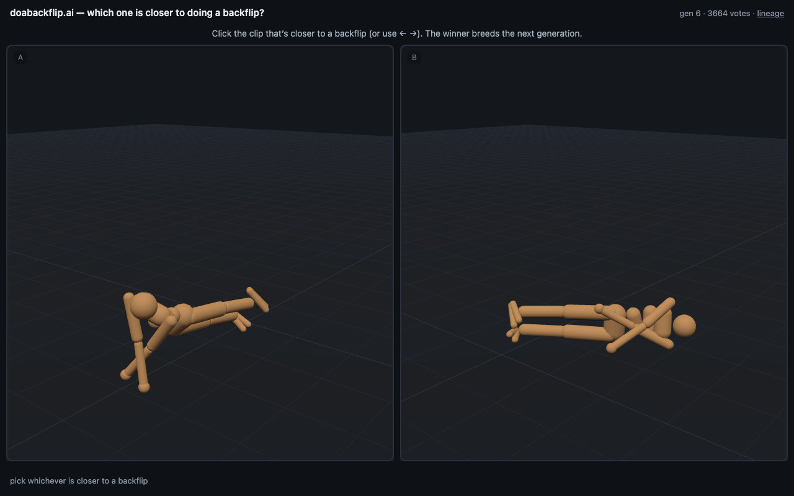
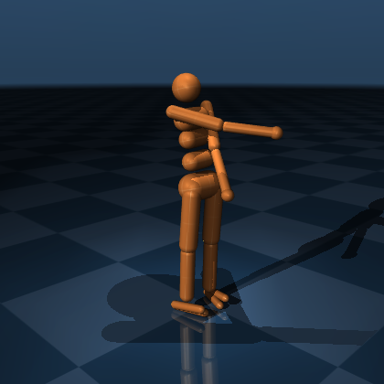

# doabackflip.ai

**The internet teaches a physics-simulated humanoid to do a backflip — one vote at a time.**

Two 3-second clips, side by side. Click whichever is *closer to doing a backflip*. Your
vote resolves a live contest between the current champion policy and a mutant challenger;
winners breed the next generation. No reward model, no gradient RLHF — the crowd **is**
the fitness function, and every promotion in the creature's lineage traces back to
specific votes cast by specific people.

| The arena | Generation 0 |
|:---:|:---:|
|  |  |
| *Gen 6: the crowd has bred 0.8 m/s crawl-sprinters from a motionless statue* | *The seed policy taught itself to stand with its arms smugly crossed — zero-torque arms are free arms* |

## Why this is harder than it looks

- **Votes are brutally scarce.** A viral spike gives you a 48-hour window of attention,
  ever. Every design decision optimizes information-per-click: pairwise comparisons (the
  one judgment strangers make reliably), sequential Beta-posterior contests that spend
  6 votes on blowouts and 20 on close calls, Wilson-lower-bound ratings so one lucky
  3-second window can't crown a mediocre policy, and stratified clip matchups so early
  votes span distinct evidence.
- **The crowd can't be trusted.** Per-session trust weights from hidden attention checks
  (a real clip vs. an unmistakable ragdoll corpse), sub-300ms bot detection, and
  click-entropy analysis. Adversaries get *down-weighted, never banned* — no clean
  detection signal to learn from.
- **Physics can't run in the browser.** Rigid-body simulation is chaotic across CPUs;
  two people voting on "clip #4821" must see byte-identical motion. Clips ship as
  **~7KB gzipped joint-angle trajectories**, rendered client-side through a
  forward-kinematics engine verified against MuJoCo to **1e-16** — a thousand
  concurrent viewers cost less bandwidth than one YouTube visitor.
- **Selection needs a substrate that can express improvement.** Torque commands pass
  through an EMA low-pass filter (twitchy bang-bang control physically can't reach the
  joints), mutant repair uses a deliberately *opinion-free* reward (alive + efficiency,
  no posture bias), and a **replay buffer** lets past champions re-enter the arena as
  zero-compute challengers — the lineage can roll itself back if it wanders.

## How a generation happens

```
                 ┌─ mutate ──── Gaussian weight noise, σ ∈ [0.01 … 0.45]
   incumbent ────┤
   (champion)    ├─ repair ──── short PPO fine-tune, stability only, no steering
                 │
                 ├─ audition ── deterministic rollouts → 3s clips → degeneracy
                 │              filter (NaN/explosion/corpse; 15% audit leak)
                 │
   crowd ────────┤─ judge ───── sequential contests, 6–20 votes, trust-weighted
                 │
                 └─ select ──── first challenger to dominate is crowned;
                                a new pool breeds from the winner
```

Batch worker (cluster) ⇄ Postgres + blob store ⇄ FastAPI (4 routes) ⇄ vanilla-JS
three.js frontend. No build step, no queue service, no Redis — the whole serving tier
fits on a $5 VPS.

## The training war stories (all real, all in the git history)

- **Vanilla PPO flatlined for 20M steps** — the humanoid fell at ~1.3s forever with 6k
  sample batches. **49k-sample batches + an entropy bonus** broke through at ~12M steps
  on a 256-core node (9,000 env-steps/sec via a process-per-env vectorizer) and passed
  the 10-seconds-upright-on-20-seeds gate.
- **Evolution discovered crawling on its own.** Given "prefer faster" votes, the lineage
  went statue → shuffle → low crawl-sprint at 30× the seed's speed within ~6
  generations — repeatedly, across independent runs. Nobody programmed crawling.
- **The synthetic crowd caught 9 real defects before any human voted**, including: a
  repair fine-tune that quietly executed every crawling mutant for the crime of not
  standing; a trust-scoring death spiral where honest voters failed attention checks
  because *the ragdoll's fall out-runs a stander*; and a ~5% false-promotion tail from
  4-vote sweeps that statistics guaranteed would corrupt the lineage. Each fix is one
  commit with the evidence in its message.

## Verification gates (the point of the whole harness)

**Phase 0 — competence:** the seed policy must survive 10s upright across 20 seeds. ✅

**Phase 1 — convergence:** the *entire* production loop — HTTP API, pair queue, trust
scoring, contest resolution, breeding — must drive 10 generations of monotone
improvement against a clean scripted preference, every contest resolving within its
vote budget. If the loop can't converge on a clean signal, it can't converge on a noisy
human one, and you'd never know why. *(Final substrate certification in progress —
best lineage so far: 8 consecutive monotone generations, 0.025 → 0.79 m/s.)*

## Run it

```bash
python3.11 -m venv .venv
.venv/bin/pip install mujoco==3.2.7 "numpy<2" torch fastapi 'uvicorn[standard]' asyncpg httpx
docker compose -f ops/docker-compose.yml up -d        # Postgres :5433, schema auto-loads

.venv/bin/python -m sim.train_stand --subproc --num-envs 48 \
    --total-steps 40000000 --num-steps 256 --ent-coef 0.005   # or ops/csl_train.sh <host>
.venv/bin/python -m sim.eval_stand                    # Phase 0 gate

.venv/bin/python -m worker.loop --bootstrap           # seed generation 0
.venv/bin/uvicorn server.app:app --port 8080          # → http://localhost:8080
while true; do .venv/bin/python -m worker.loop --cycle; sleep 20; done

.venv/bin/python -m synthetic.run_phase1              # Phase 1 gate (full loop, no humans)
```

## Roadmap

- [x] Standing seed policy (large-batch PPO, cluster-trained)
- [x] Full pipeline: worker / Postgres / API / three.js renderer
- [x] Synthetic-crowd verification harness + 9 defects found and fixed
- [x] Substrate smoothing, replay-buffer ancestors, stratified matchups
- [ ] Phase 1 certification on final substrate
- [ ] Private human pilot (clip-length, position-bias, retention instrumentation)
- [ ] Public launch at **doabackflip.ai**
- [ ] MAP-Elites behavior grid — 25 parallel lineages ("the internet built 25 of these")
- [ ] Reward-model hybrid: votes shape the mutation prior, crowd keeps the veto

---

*Stack: MuJoCo · PyTorch · FastAPI · Postgres · three.js. Physics server-side for
determinism, rendering client-side for economics, selection crowd-side for the story.*
